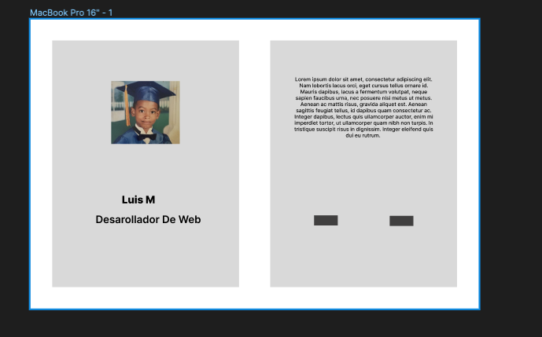

Wireframe

Es tiempo de crear tu pagina web. 
Para lograrlo necessitas entender la technologia que esta detras de ellas. 
Estas technologias se llaman HTM, CSS y JavaScript.

En los proximos retos utilizaremos JavaScript, en este quiero me que me hagas un `wireframe`, un wireframe es un dise~o extremadamente simple, contine elementos basicos donde se illustra cuanto espacio esos elementos tomaran, esto nos da una illustracion de como organizar informacion en la pagina web.

Ve al web y investiga que es HTML y CSS. 
Una vez entiendas, crea el `wireframe` con los proximos objectivos

Objectivo:
* Refactorea `index.html` para que sea como el `wireframe`
* Asegura que pongas tu nombre, una foto de perfil y tu titulo(eg:"Desarolladora") a las izquierda
* A la derecha, a~ade una biografia basica, con dos botones, uno para tu perfil de Github y otro para Linkedin,estos botones sera enlaces que lleven a tus perfiles sociales de Github y Linkedin.
* Guarda los cambios en un commit llamado `wireframe`
